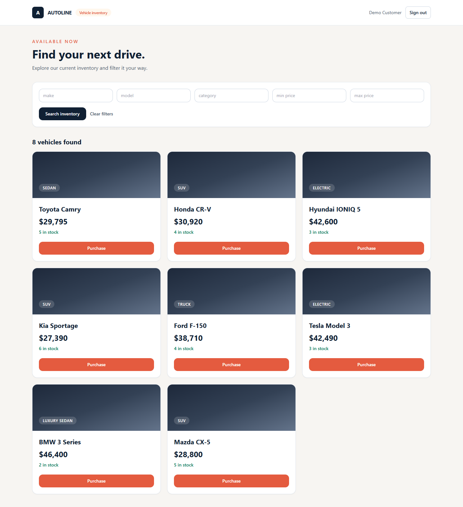
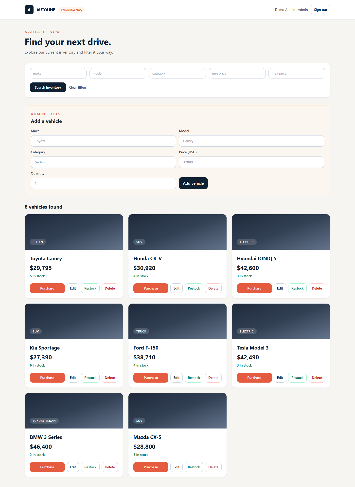

# Car Dealership Inventory System

A full-stack inventory management application for a car dealership. It allows customers to browse and purchase vehicles while giving administrators secure tools to manage stock.

## Features

- User registration and login with JWT-based authentication
- Secure password hashing with Argon2
- Role-based authorization for administrator actions
- Add vehicles to inventory as an administrator
- View the vehicle inventory as an authenticated user
- Search by make, model, category, and price range
- Purchase a vehicle with stock-safe inventory updates
- Clear out-of-stock handling that prevents negative quantities

## Technology stack

- **Backend:** Python, FastAPI, SQLAlchemy
- **Database:** SQLite for local development, with `DATABASE_URL` support for PostgreSQL deployment
- **Authentication:** JWT and Argon2 password hashing
- **Testing:** pytest and FastAPI TestClient
- **Frontend:** React, Vite, and Tailwind CSS

## Project structure

```text
backend/
  app/          # API routes, database models, schemas, and security
  tests/        # Behaviour-focused API tests
  data/         # Local SQLite database location (database file is ignored by Git)
frontend/       # React and Tailwind single-page application
docs/           # Screenshots and test report
```

## Run locally

### Prerequisites

- Python 3.13 or later
- Node.js 24 or later (required once the frontend is set up)

### Backend setup

```powershell
cd backend
..\.venv\Scripts\python.exe -m pip install -r requirements.txt
$env:JWT_SECRET = "replace-this-with-a-long-random-secret"
..\.venv\Scripts\python.exe -m uvicorn app.main:app --reload
```

The API will be available at `http://127.0.0.1:8000`. Interactive documentation is available at `http://127.0.0.1:8000/docs`.

### Create a local administrator

Regular registration creates a customer account. To demonstrate inventory management features, create an administrator in a separate terminal:

```powershell
cd backend
..\.venv\Scripts\python.exe create_admin.py --name "Inventory Admin" --email "admin@example.com"
```

The command securely prompts for the password and creates the account (or promotes an existing account).

### Seed demonstration inventory

```powershell
cd backend
..\.venv\Scripts\python.exe seed_inventory.py
```

This adds current, real vehicle models for demonstration. Prices and stock quantities are sample dealership data and are not live offers.

### Frontend setup

In a second terminal, run:

```powershell
cd frontend
npm install
npm run dev
```

Open the URL printed by Vite, normally `http://127.0.0.1:5173`. Keep the backend running while using the frontend.

### Run the tests

```powershell
cd backend
..\.venv\Scripts\python.exe -m pytest -q
```

Run frontend tests and create a production build with:

```powershell
cd frontend
npm test
npm run build
```

The latest verification results are in [docs/test-report.md](docs/test-report.md).

## API endpoints implemented

| Method | Endpoint | Access | Description |
| --- | --- | --- | --- |
| POST | `/api/auth/register` | Public | Register a customer and receive a JWT |
| POST | `/api/auth/login` | Public | Log in and receive a JWT |
| POST | `/api/vehicles` | Admin | Add a vehicle to inventory |
| GET | `/api/vehicles` | Authenticated | List inventory |
| GET | `/api/vehicles/search` | Authenticated | Search and filter inventory |
| PUT | `/api/vehicles/{id}` | Admin | Update vehicle details |
| DELETE | `/api/vehicles/{id}` | Admin | Delete a vehicle |
| POST | `/api/vehicles/{id}/purchase` | Authenticated | Purchase one unit when stock is available |
| POST | `/api/vehicles/{id}/restock` | Admin | Increase vehicle stock |

## Development approach

Each backend feature is developed in small red-green-refactor cycles. Tests specify observable behavior first, implementation makes the test pass, and the code is then kept clean through refactoring. The Git history documents these focused milestones.

## Screenshots

### Customer dashboard



### Administrator dashboard



## My AI Usage

I used Codex as a development assistant to discuss the architecture, generate initial test and implementation drafts, and troubleshoot environment issues. I reviewed the generated work, ran the tests after each change, and used the results to guide the next iteration. AI-assisted commits include the required co-author trailer. The raw, unedited interaction record is maintained in `PROMPTS.md` as required by this assignment.

## Optional next steps

- Deploy the frontend and API for a public live demonstration.
- Configure PostgreSQL and Alembic migrations for production deployment.
